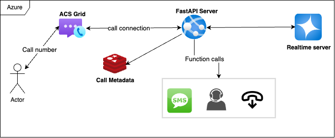

# Project Architecture



## Pain Point

Redis cache is used to track essential user metadata, such as CallConnectionId and PhoneNumber. When the websocket connection is established, the packets sent lack this crucial information. As a workaround, a unique session ID (UUID) is generated for each customer session and is gradually updated with the corresponding metadata.

This unique ID allows us to correlate customer metadata, enabling actions like sending SMS, terminating calls, and transferring users to support. Although this method is effective, it is not ideal. I have raised the issue with Azure support and filed a feature request. Any updates will be shared here.

## Prerequisites

Ensure you have the following:

- **Azure Subscription:**  
    An active Azure account. [Create a free account](https://azure.microsoft.com/free/?WT.mc_id=A261C142F).

- **Communication Services Resource:**  
    A deployed Communication Services resource. [Get started here](https://docs.microsoft.com/azure/communication-services/quickstarts/create-communication-resource).

- **Phone Number:**  
    A phone number in your Communication Services resource that can receive inbound calls. [Learn more](https://learn.microsoft.com/en-us/azure/communication-services/quickstarts/telephony/get-phone-number).  
    *Note: Phone numbers might not be available under free subscriptions.*

- **Python Environment:**  
    Python 3.7 or above. [Download Python](https://www.python.org/downloads/).

- **Azure OpenAI Resource:**  
    An Azure OpenAI resource with a deployed model. [Follow these steps](https://learn.microsoft.com/en-us/azure/ai-services/openai/how-to/create-resource?pivots=web-portal).

## Set Up and Host Your Azure DevTunnel

Azure DevTunnels lets you share local web services securely over the internet. Execute the following commands to create a persistent endpoint that allows anonymous access:

```bash
devtunnel create --allow-anonymous
devtunnel port create -p 8000
devtunnel host
```

## Configure API Keys and Endpoints

1. Copy `dummy.env` to create an `.env` file.
2. Update the `.env` file with your specific keys and endpoint configurations.

In the folder `app/call_router_handler`, adjust the configuration for each ACS number using a mapping, for example:

```python
knowledge_base_table = {
        "+1234567890": {
                "SEARCH_INDEX": "dummy-index",
                "SEARCH_SEMANTIC_CONFIGURATION": "dummy-semantic-config"
        }
}
```

## Run the Python Environment Locally

Install the required version and dependencies defined in your `pyproject.toml`:

```bash
uv sync
```

Then, run the project locally with:

```bash
uv run uvicorn app.main:app --reload
```

## Run the Project in a Docker Container

First, build the Docker image:

```bash
docker build -t fastapi-app -f Dockerfile.dev .
```

Next, run the Docker container using:

```bash
docker run -p 8000:8000 fastapi-app
```

## Final Configuration

Once your server is running normally, configure the DevTunnel endpoint over ACS Event Grid:

- Select the filtering event as **'Incoming Call'**.
- Verify that the connection succeeds to properly receive calling events.

Happy coding!